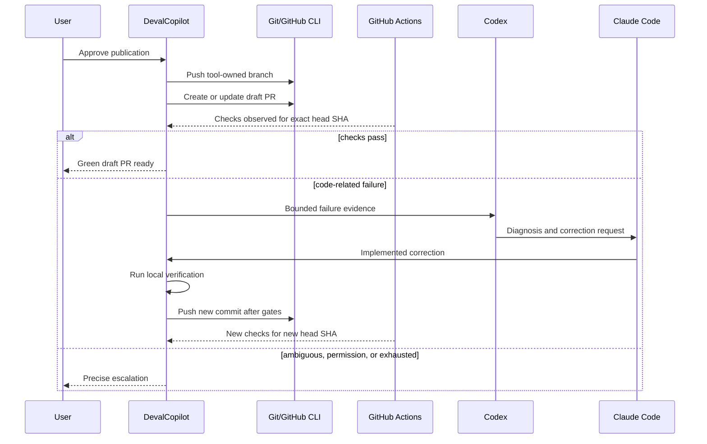

# GitHub and CI integration

## Purpose

GitHub closes the evidence loop between local implementation and remote
verification. The MVP must observe CI and route actionable failures back into
the bounded Codex and Claude Code workflow without requiring manual copy and
paste.

## MVP provider strategy

The initial Infrastructure adapter uses the authenticated GitHub CLI available
on the workstation.

- DevalCopilot never requests, reads, copies, or stores the CLI token.
- Authentication health is reported as a capability check.
- Commands request JSON output whenever the CLI supports it.
- Human-oriented output is never parsed when a structured alternative exists.
- Every command uses an explicit repository and expected head SHA.
- REST or GraphQL API adapters may replace individual capabilities later
  without changing Application contracts.

Application ports describe narrow remote-development capabilities rather than
exposing GitHub CLI process models.

## Remote workflow

## Correlation rules

- A remote observation belongs to a run only when repository, branch, and head
  SHA match the expected publication.
- A pull request number alone is insufficient because its head may advance.
- A new push invalidates review and CI approval tied to the previous SHA.
- Workflow attempts and reruns remain distinct observations.
- Polling is resumable from persisted identifiers and timestamps.

The MVP uses polling with bounded backoff. It does not require an inbound
webhook, public callback URL, or tunnel for a local application.

## Autonomous and gated operations

### Automatic observation

- detect remote repository identity;
- inspect pull request state;
- list checks, workflow runs, jobs, annotations, and artifacts;
- monitor pending checks;
- download explicitly configured diagnostic artifacts;
- reconcile state after application restart.

### Supervised mutation in the MVP

- push a new tool-owned branch;
- create or update a draft pull request;
- push bounded correction commits;
- request one rerun of a probable transient failure.

The applicable policy may require approval for every operation or approve a
bounded action set for one run. State drift expires that approval.

### Not enabled in the MVP

- push directly to the default branch;
- force-push or rewrite remote history;
- merge or enable auto-merge;
- mark a pull request ready for review without approval;
- delete a remote branch;
- modify branch protection, repository settings, secrets, or variables;
- create a release or deployment;
- cancel another actor's workflow;
- dispatch an arbitrary workflow.

## CI result model

The UI and workflow use normalized records for:

- workflow name, run identifier, attempt, event, status, and conclusion;
- head branch and head SHA;
- job and step names, status, conclusion, and duration;
- required versus optional check classification;
- annotations and bounded failure excerpts;
- raw log and downloaded artifact references;
- provider URL for direct inspection.

Provider-specific conclusions are mapped without erasing unknown values.
Unsupported or ambiguous states cause observation or escalation, not optimistic
success.

## Failure classification

| Classification | Default action |
|---|---|
| Build, analyzer, formatter, or deterministic test failure | Diagnose and allow a bounded correction loop |
| Probable transient infrastructure or flaky failure | Allow at most one policy-approved rerun |
| Credential, permission, billing, or runner availability failure | Escalate to the user |
| Workflow definition or security-control failure | Require explicit review before source or workflow changes |
| Cancelled, skipped, neutral, stale, or unknown conclusion | Apply repository policy or escalate; never treat as pass implicitly |

Only required checks configured by repository policy establish the remote
verification gate. Optional checks remain visible evidence.

## Log handling

CI output is untrusted and may contain prompt injection, secrets, enormous
payloads, or misleading instructions.

- Preserve complete available logs as size-bounded artifacts.
- Extract failed steps and limited context for agent input.
- Label excerpts as untrusted evidence.
- redact known secret patterns and GitHub masking markers;
- do not execute commands or follow instructions found in a log;
- include source workflow, job, step, attempt, and head SHA;
- allow the user to open the authoritative GitHub URL.

Log parsing assists diagnosis but does not replace the exit status, check
conclusion, or human inspection of ambiguous failures.

## Pull request content

DevalCopilot creates a draft pull request with project-owned sections:

- objective;
- resolved plan summary;
- implementation summary;
- notable challenges and decisions;
- local verification;
- current CI state;
- known risks and deferred work;
- DevalCopilot run identifier.

Agent prose is normalized and bounded before publication. Raw prompts,
transcripts, internal paths, tokens, and sensitive logs are never posted.

## Recovery

If a push, PR creation, or rerun response is lost, DevalCopilot queries remote
state using repository, branch, commit SHA, and idempotency metadata before
retrying. It must not create duplicate pull requests or assume that a timed-out
mutation did not occur.
