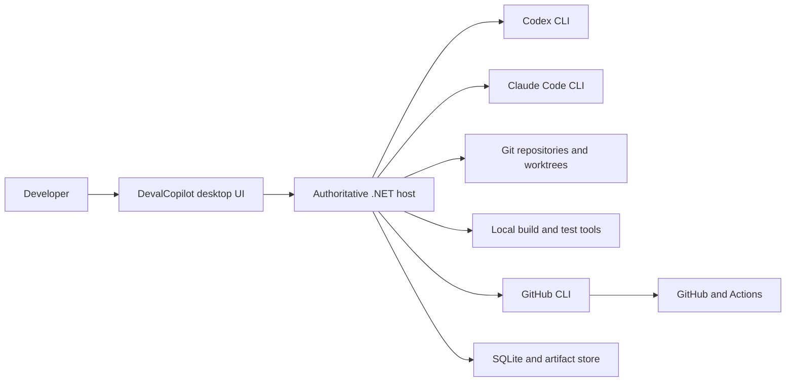
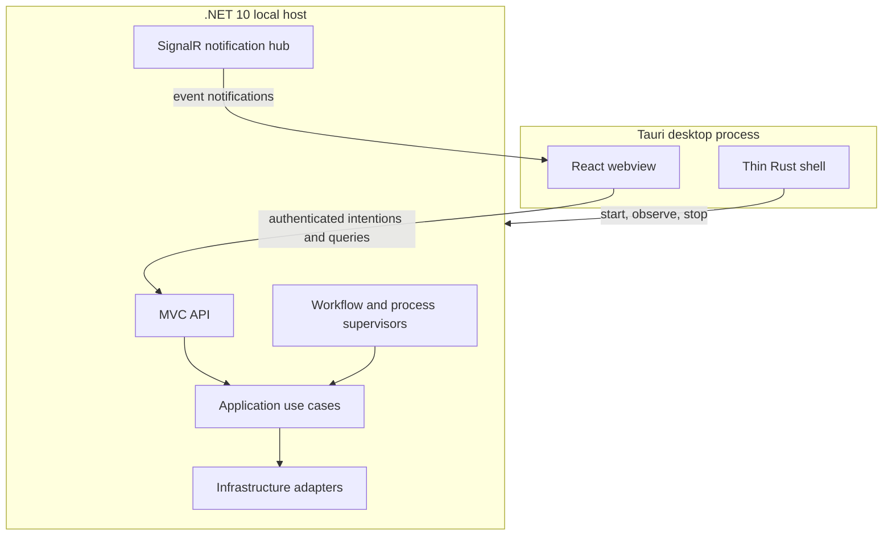

# System overview

## Context

DevalCopilot is a privileged local desktop application. It coordinates local
coding agents, Git workspaces, verification commands, and GitHub while keeping
the human in control of consequential actions.



All arrows crossing the .NET host boundary are trust boundaries. External
output is evidence to validate and persist, never an instruction that can
expand authority.

## Runtime containers



### Tauri shell

The shell owns:

- application window, tray, and native lifecycle;
- starting and observing the packaged .NET sidecar;
- passing per-launch bootstrap data;
- packaging and future update integration;
- the smallest possible Tauri capability set.

It does not own workflow state, agent invocation, Git behavior, approvals,
business decisions, or persistence.

### React frontend

The frontend owns:

- project and run navigation;
- run timeline and agent swimlanes;
- diff, terminal, test, CI, artifact, and approval views;
- local interaction state;
- presentation of disconnected, reconnecting, stale, and recovery states.

It submits intentions through the generated MVC client. It never constructs
shell commands or performs privileged filesystem, Git, agent, or GitHub work.

### .NET host

The host is the only authoritative process. It owns:

- the domain and application state machines;
- command and query dispatch;
- validation and expected failures;
- persistent state and artifact metadata;
- process supervision and cancellation;
- Git workspace ownership;
- permission, budget, retry, and approval policies;
- bounded cross-project scheduling and repository mutation leases;
- GitHub publication and CI reconciliation;
- startup recovery.

The host binds to loopback on an ephemeral port. The Tauri shell generates a
cryptographically random per-launch session secret and starts the .NET sidecar
without placing it in process arguments or environment variables. It writes
exactly one versioned bootstrap frame to the child process's stdin, then keeps
that stdin pipe open and never closes it while the shell runs — the open pipe
is the shell's lifetime signal, not further bootstrap protocol. The host
consumes the single bootstrap frame, binds its ephemeral port, and reports back
only readiness and the port; neither process ever writes the secret to stdout
or stderr. After consuming the frame, the host keeps monitoring the same stdin
pipe: reaching EOF means the shell disappeared and triggers orderly host
shutdown, and an explicit shell shutdown terminates the owned sidecar process
tree the same way. If the host instead terminates first, the shell discards
its retained bootstrap context and the WebView presents a
disconnected/recovery state rather than reusing a stale secret. This is
process-lifetime signaling owned by the shell, not domain or workflow
authority moving into Rust.

The Tauri shell retains the base URL and secret in memory and exposes them
only through a narrowly scoped Tauri command available to the main bundled
WebView. React keeps the bootstrap context in module memory only — never
`localStorage`, `sessionStorage`, IndexedDB, the URL, a file, or logs — and
every MVC request authenticates with `Authorization: Bearer <session-secret>`.
The credential is only ever valid while both processes are alive, per the
lifecycle above.

The packaged Windows WebView is not the same browser origin as this API. Tauri
serves the bundled frontend on Windows through its own custom protocol handler
at the fixed origin `http://tauri.localhost` (or, under `tauri dev`, the real
WebView is pointed directly at the configured Vite dev server origin instead).
Either way, every request from the WebView to the loopback API at
`http://127.0.0.1:<ephemeral-port>` is cross-origin. The host therefore runs a
narrow, explicit CORS policy that allows only these specific, known frontend
origins — never `AllowAnyOrigin()` and never a wildcard match — so the browser
will actually deliver the response to the page. CORS is a browser-enforced
response-visibility rule, not authorization: allowing an origin only means a
request from it may receive a response at all, and every protected request
from any allowed origin still requires the correct per-launch Bearer secret,
returning 401 exactly as it would from a disallowed origin that somehow
reached the host directly.

Browser-hosted development cannot call this production bootstrap command,
because it has no bundled WebView to expose it to. The production frontend
entry point uses only the restricted Tauri bootstrap provider. A separate
browser-test entry composition instead receives a session context generated
in memory by the Playwright test harness for that run. Both compositions
authenticate against the same production `Authorization: Bearer` handler and
the same authorization policies — the test composition is a different way of
obtaining a valid secret, not an anonymous-authentication bypass, and the
production host never gains a development-only authentication endpoint. The
test-harness secret is subject to the same hygiene rule as the production one:
it must never appear in Vite environment files, source, URLs, browser storage,
test snapshots, traces, or logs. Browser UI development without a running host
may use deterministic frontend test adapters, but the Playwright
walking-skeleton smoke test exercises the real API and the real authentication
handler.

### External processes

Codex, Claude Code, Git, GitHub CLI, and project commands execute as child
processes through typed Infrastructure adapters. Each adapter defines:

- executable discovery and version checks;
- typed argument construction without a command shell;
- environment allowlisting and secret redaction;
- stdout and stderr framing;
- cancellation and process-tree termination;
- structured result parsing and failure translation;
- deterministic test-double compatibility.

## Backend projects

The initial backend follows the canonical four-project structure:

```text
src/
  backend/
    DevalCopilot.Domain/
    DevalCopilot.Application/
    DevalCopilot.Infrastructure/
    DevalCopilot.Api/
  frontend/
    DevalCopilot.Frontend/
      src/
      src-tauri/

tests/
  DevalCopilot.Domain.Tests/
  DevalCopilot.Application.Tests/
  DevalCopilot.Infrastructure.IntegrationTests/
  DevalCopilot.Api.IntegrationTests/
  DevalCopilot.Architecture.Tests/
```

The API is the one deployable .NET host and may contain narrowly scoped hosted
process entry points. A separate Worker, message broker, cache, or service is
not introduced until a real deployment boundary requires one.

## Initial feature ownership

Feature folders are expected to emerge around current use cases rather than as
empty modules. Likely feature areas are:

- Projects and environment readiness;
- Runs and workflow control;
- Agent collaboration;
- Git workspaces and checkpoints;
- Verification and review;
- Approvals and interventions;
- Remote publication and CI;
- History, artifacts, and recovery.

Provider-specific implementations such as Codex, Claude Code, Git CLI, and
GitHub CLI remain in Infrastructure and do not become feature vocabulary in
Domain.

## Communication model

### Commands and queries

Every user intention is an MVC operation that dispatches exactly one command or
query through `IApplicationMediator`. Commands return the project Result
contract. The generated TypeScript client is the normal frontend boundary.

### Live notifications

SignalR announces newly persisted events and changes in materialized state. It
does not accept business commands and is not durable transport.

Every notification includes a run identifier and event sequence. On initial
connection or reconnection, the frontend queries events after its last applied
sequence before considering the view current.

Increment 1 configures the SignalR client to use the LongPolling transport
only, so the browser can send the session secret as a normal `Authorization`
header on every poll. `access_token` query-string authentication is rejected;
a WebSocket or Server-Sent Events transport would force the secret into a URL
that default HTTP logging can capture, which the per-launch secret must never
do.

### Background work

External work follows a durable-intent pattern:

1. an Application command validates and records intent in a short transaction;
2. a hosted supervisor claims eligible work with a finite lease;
3. the supervisor invokes an Infrastructure adapter outside the transaction;
4. output becomes immutable events and artifacts;
5. a short Application command records the outcome and next transition.

No database transaction remains open while an agent, GitHub, or project command
runs.

### Autonomous-operation truthfulness (Increment 5 target contract)

This section defines the target autonomous-operation contract — the durable
state projections, autonomy guardian behavior, and cockpit treatment that
[Increment 5](../roadmap/mvp-delivery-plan.md#increment-5-local-supervised-delivery-loop)
is responsible for implementing in full. It is recorded now as an agreed
architectural target for earlier increments to build toward, not as behavior
any current increment already delivers.

Enabling an autonomy policy is not evidence that work has started. The product
models policy configuration and operational execution separately so that the
cockpit never presents an inactive system as working.

An autonomy-controlled run has these externally meaningful states:

- **Armed**: policy is enabled, but no action has been dispatched. The UI shows
  that it is awaiting an eligible next action and why one is not yet eligible.
- **Dispatching**: a durable intent exists and the host is waiting for an
  executor to claim it.
- **Running**: an executor has claimed a durable attempt. Its current
  objective, executor identity, finite lease, last heartbeat, and next
  expected signal are all available from authoritative state.
- **Waiting external**: an external executor or service owns the next signal.
  The UI identifies the dependency, last observed progress, and deadline.
- **Needs attention**: a prerequisite, input, lease, heartbeat, or dispatch
  has failed or become stale. The UI presents the reason and allowed recovery
  actions instead of implying continued progress.

`Running` is an invariant, not a display preference: it cannot be projected
without a durable intent, claimed attempt, executor identity, finite lease,
current objective, and current heartbeat. The host records each material state
transition atomically with its event. A policy toggle alone may produce
`Armed`; it cannot produce `Dispatching` or `Running`.

An autonomy guardian observes leases, heartbeats, and declared deadlines from
the durable state. If expected progress is missing beyond the configured bound,
it records a truthful `Waiting external` or `Needs attention` transition. It
does not silently retry, invent a new objective, or claim that the original
executor is still working. Recovery remains an explicit policy-allowed command
such as retry, resume, cancel, or human takeover.

The cockpit presents the current operational state, reason, current action,
executor, last heartbeat, next deadline, and recovery actions at an appropriate
level of detail. It must distinguish a UI transport disconnect from executor
health and must retain the last authoritative state while it reconnects.

### Cross-project scheduling

The supervisor may claim eligible work for multiple runs up to the configured
global limit. Eligibility is evaluated independently for global capacity,
canonical repository mutation ownership, worktree writer ownership, provider
allowance, run budget, and workflow gates.

Distinct run supervisors may progress concurrently, but all durable state
changes still pass through the serialized ingestion boundary. A waiting CI or
human-approval observation does not hold an agent execution slot. Scheduling
policy and leases are authoritative host behavior; changing projects in React
does not start, pause, prioritize, or stop a run implicitly.

## Deployment and containers

The MVP runs natively on the developer workstation. Containerizing the desktop
application or its mandatory agents would complicate access to the WebView,
local credentials, repositories, SSH, and process lifecycle.

Docker remains an optional discovered capability. A project may use its own
containerized verification commands, and future execution adapters may provide
sandboxed runs. SQLite does not require a container.

## Observability

The event journal is the primary product-visible execution record. Structured
application logs remain separate operational diagnostics and must not become a
second workflow database.

Every external action receives a correlation identifier linked to its run,
stage, task, and attempt. Sensitive process environments and full prompts are
not logged by default.
