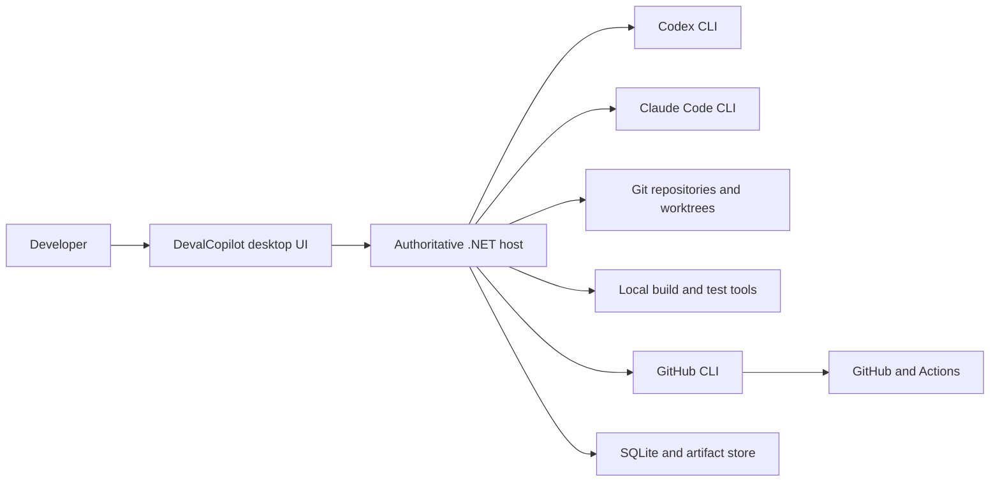
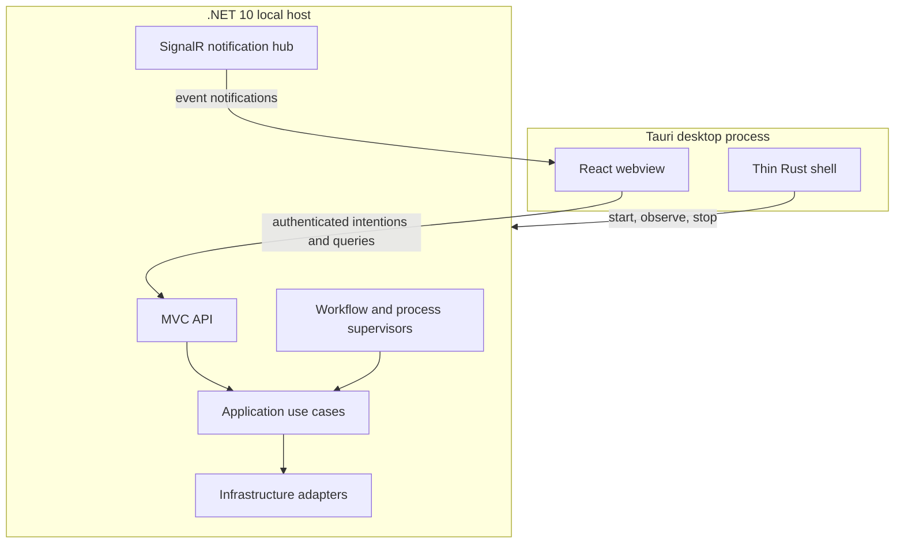

# System overview

## Context

DevalCopilot is a privileged local desktop application. It coordinates local
coding agents, Git workspaces, verification commands, and GitHub while keeping
the human in control of consequential actions.



All arrows crossing the .NET host boundary are trust boundaries. External
output is evidence to validate and persist, never an instruction that can
expand authority.

## Runtime containers



### Tauri shell

The shell owns:

- application window, tray, and native lifecycle;
- starting and observing the packaged .NET sidecar;
- passing per-launch bootstrap data;
- packaging and future update integration;
- the smallest possible Tauri capability set.

It does not own workflow state, agent invocation, Git behavior, approvals,
business decisions, or persistence.

### React frontend

The frontend owns:

- project and run navigation;
- run timeline and agent swimlanes;
- diff, terminal, test, CI, artifact, and approval views;
- local interaction state;
- presentation of disconnected, reconnecting, stale, and recovery states.

It submits intentions through the generated MVC client. It never constructs
shell commands or performs privileged filesystem, Git, agent, or GitHub work.

### .NET host

The host is the only authoritative process. It owns:

- the domain and application state machines;
- command and query dispatch;
- validation and expected failures;
- persistent state and artifact metadata;
- process supervision and cancellation;
- Git workspace ownership;
- permission, budget, retry, and approval policies;
- GitHub publication and CI reconciliation;
- startup recovery.

The host binds to loopback on an ephemeral port. Tauri launches it with a
single-use bootstrap channel that communicates the port and a random session
secret. The secret remains in memory and is not written to frontend storage.

### External processes

Codex, Claude Code, Git, GitHub CLI, and project commands execute as child
processes through typed Infrastructure adapters. Each adapter defines:

- executable discovery and version checks;
- typed argument construction without a command shell;
- environment allowlisting and secret redaction;
- stdout and stderr framing;
- cancellation and process-tree termination;
- structured result parsing and failure translation;
- deterministic test-double compatibility.

## Backend projects

The initial backend follows the canonical four-project structure:

```text
src/
  backend/
    DevalCopilot.Domain/
    DevalCopilot.Application/
    DevalCopilot.Infrastructure/
    DevalCopilot.Api/
  frontend/
    DevalCopilot.Frontend/
      src/
      src-tauri/

tests/
  DevalCopilot.Domain.Tests/
  DevalCopilot.Application.Tests/
  DevalCopilot.Infrastructure.IntegrationTests/
  DevalCopilot.Api.IntegrationTests/
  DevalCopilot.Architecture.Tests/
```

The API is the one deployable .NET host and may contain narrowly scoped hosted
process entry points. A separate Worker, message broker, cache, or service is
not introduced until a real deployment boundary requires one.

## Initial feature ownership

Feature folders are expected to emerge around current use cases rather than as
empty modules. Likely feature areas are:

- Projects and environment readiness;
- Runs and workflow control;
- Agent collaboration;
- Git workspaces and checkpoints;
- Verification and review;
- Approvals and interventions;
- Remote publication and CI;
- History, artifacts, and recovery.

Provider-specific implementations such as Codex, Claude Code, Git CLI, and
GitHub CLI remain in Infrastructure and do not become feature vocabulary in
Domain.

## Communication model

### Commands and queries

Every user intention is an MVC operation that dispatches exactly one command or
query through `IApplicationMediator`. Commands return the project Result
contract. The generated TypeScript client is the normal frontend boundary.

### Live notifications

SignalR announces newly persisted events and changes in materialized state. It
does not accept business commands and is not durable transport.

Every notification includes a run identifier and event sequence. On initial
connection or reconnection, the frontend queries events after its last applied
sequence before considering the view current.

### Background work

External work follows a durable-intent pattern:

1. an Application command validates and records intent in a short transaction;
2. a hosted supervisor claims eligible work with a finite lease;
3. the supervisor invokes an Infrastructure adapter outside the transaction;
4. output becomes immutable events and artifacts;
5. a short Application command records the outcome and next transition.

No database transaction remains open while an agent, GitHub, or project command
runs.

## Deployment and containers

The MVP runs natively on the developer workstation. Containerizing the desktop
application or its mandatory agents would complicate access to the WebView,
local credentials, repositories, SSH, and process lifecycle.

Docker remains an optional discovered capability. A project may use its own
containerized verification commands, and future execution adapters may provide
sandboxed runs. SQLite does not require a container.

## Observability

The event journal is the primary product-visible execution record. Structured
application logs remain separate operational diagnostics and must not become a
second workflow database.

Every external action receives a correlation identifier linked to its run,
stage, task, and attempt. Sensitive process environments and full prompts are
not logged by default.
