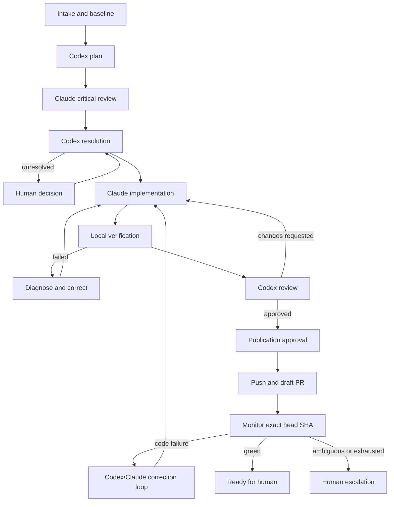

# Workflow model

## Design rule

The workflow is not represented by one giant status enum. Run lifecycle, stage
progress, agent process state, review outcome, approval state, Git state, and
remote CI state evolve independently and have different transition rules.

Materialized state is derived from explicit commands and immutable events. The
orchestrator rejects an action when any required dimension is incompatible.

## State dimensions

### Run lifecycle

```text
Created -> Running -> Completed
                   -> Failed
                   -> Cancelled

Running <-> Paused
Running -> Interrupted -> Running | Failed | Cancelled
```

- `Created`: objective and baseline exist, but execution has not started.
- `Running`: at least one stage may advance.
- `Paused`: no new external action may start; already running actions follow the
  selected pause policy.
- `Interrupted`: the previous host stopped without a terminal transition and
  reconciliation is required.
- terminal states are `Completed`, `Failed`, and `Cancelled`.

### Stage progress

`Pending`, `Ready`, `Active`, `Blocked`, `Completed`, `Failed`, or `Skipped`.

A stage becomes `Ready` only when its prerequisites and gates are satisfied.
`Blocked` always records a reason and the event or action that can unblock it.

### Attempt process state

`Queued`, `Starting`, `Running`, `Completed`, `Failed`, `Cancelled`, `TimedOut`,
or `Lost`.

A retry creates a new attempt. A previous attempt remains immutable. `Lost`
means the host cannot prove whether the external process completed and must
reconcile state before another writer starts.

### Review outcome

`Pending`, `Approved`, `ChangesRequested`, or `Escalated`.

Review approval refers to one exact Git fingerprint and evidence set. A source
change invalidates the approval.

### Current Git evidence boundary

Increment 3 records an append-only, per-workspace `GitCheckpoint` only after a
bounded, internally consistent local capture. Its fingerprint covers the exact
`HEAD`, porcelain state, complete tracked binary diff, and hashes of bounded
untracked files; a capture that changes while it is observed, times out, or
exceeds its bound is discarded. Changed-file metadata is durable, while complete
diff text stays transient and is returned only after a fresh capture still
matches the requested checkpoint. This makes a stale checkpoint an explicit
conflict rather than silently presenting it as current source evidence.

### Current verification configuration and execution boundary

Increment 3 persists project-owned verification recipes as an absolute executable path, a
bounded literal argument array, timeout, and enabled state. A claim snapshots an enabled recipe
and the selected Git checkpoint only when the workspace is `Ready`, its mutation lease is
`Active`, and a fresh evidence capture still matches that checkpoint. The host persists the
claim and a dispatch marker before starting the child process; the process uses no shell, no
PATH lookup, and no ambient environment, and its working directory is the isolated workspace.

The host captures only redacted, bounded stdout/stderr under the application artifact root,
seals and hashes each file outside the database transaction, then persists the metadata and
completion evidence. Same-host result metadata records whether each stream was truncated;
restart-recovered output records host interruption with truncation unknown. The protected output
query rechecks path containment, byte length, and SHA-256 before returning a bounded window. A
changed completion fingerprint records `SourceChanged` even when the process exits with code 0.
Undispatched claims are pending,
dispatched claims are running, and terminal results remain durable and queryable. On restart,
sealed stdout/stderr files for still-running executions are independently re-described and
imported once before those executions are reconciled as `Interrupted`; partial-only files are
deleted as non-evidence, and no process outcome is fabricated or redispatched.

Local review evidence is an append-only `CheckpointReview` fact. It snapshots the selected
checkpoint fingerprint and, for a decision that cites verification evidence, the exact execution
ID, terminal status, and truthful process outcome when one exists; interrupted executions and
source changes detected before dispatch have no invented outcome or exit code. It never copies
command arguments, paths, output text, or artifact metadata. The API accepts a review only when
the isolated workspace is `Ready`, its lease is active, the selected checkpoint is the latest
persisted checkpoint for that workspace, and a fresh bounded source capture still matches it.
`Pending` is an execution-free recorded review state. `ChangesRequested` and `Escalated` may cite
any terminal execution for that exact checkpoint; `Approved` additionally requires a passed
execution. Review reads re-capture current source evidence: an older approval remains historical
evidence but is marked not applicable with a fixed stale reason when a newer checkpoint exists or
the source fingerprint has drifted.

### Current agent-implementation boundary

The `Execute["Claude implementation"]` node in the MVP workflow diagram below
names the full, aspirational loop; only part of it is real today. A Claude
implementation attempt durably implements exactly one authoritative resolved
plan (an accepted original Proposal, or a resolved revised Proposal) entirely
inside the run's owned worktree, and — on success — records one new immutable
`GitCheckpoint` plus its changed-file rows and exactly one Execution report.
It never runs the configured local verification commands, a commit, a push,
or any network operation itself. A failed, invalid, or evidence-unavailable
attempt never rolls back or discards whatever the worktree already holds;
when the worktree may have changed without a verified, trustworthy result to
show for it, the workspace is flagged `NeedsAttention` instead of being
silently retried.

### `LocalVerify` → `Review["Codex review"]` boundary

`LocalVerify` (the existing verification-command claim/dispatch/completion
lifecycle) and the diagram's `Review["Codex review"]` node are now both real,
and the boundary between them is real too. A Codex code-review attempt
(`AgentRole.CodeReviewer`, `AgentResponseContract.ImplementationReview`) is
claimable only against: the exact real, complete implementation result — a
Claude Implementer attempt that completed `Implemented`, whose immutable
result `GitCheckpoint` is exactly the workspace's current checkpoint, and
whose one provider-observed Execution report is unique for that attempt —
and a closed, complete verification-evidence chain: every currently enabled
verification command has a latest execution bound to that exact checkpoint,
terminal, and Passed. The claimed Execution report and the exact ordered
verification-execution set are both recorded durably before Codex is ever
invoked (an `AttemptInputMessage` row and a dedicated
`AttemptVerificationEvidence` membership per claimed execution, mirroring the
plan/challenge input-identity pattern one level further down the protocol) —
never a JSON blob standing in as the authoritative set, and never an
arbitrarily selected execution when several enabled commands exist. Missing,
running, failed, interrupted, timed-out, cancelled, source-changed, foreign,
duplicate, disabled, or stale evidence all fail the claim closed with a
stable, path-free reason code.

Codex's review is strictly read-only: the adapter reuses the same bounded,
non-interactive `CodexProcessInvoker` contract as Codex planning and
challenge resolution, with no Git, process, network, or repository-mutation
capability, constrained to a closed discriminated response —
`ReviewApproved` (a bounded rationale and residual risks, zero findings) or
`ReviewChangesRequested` (one to ten bounded material findings, each with a
closed severity/category, evidence, and the required change; an optional
repository-relative affected path that is surfaced only through the sealed
final-response artifact, never duplicated into the durable collaboration
ledger). Fresh Git evidence is re-captured immediately before dispatch and
again after the provider exits; any drift downgrades the result to
`SourceChanged` unconditionally — an approval or a finding set is never
recorded against a checkpoint the review did not actually evaluate. On
success, the review's exact claimed verification-execution set is
materialized into one immutable `CheckpointReview` and its complete
`CheckpointReviewEvidence` set (`ReviewActorKind.FutureAgent`), atomically
alongside either one `ReviewApproval` collaboration message or one
`ReviewFinding` message per finding — each replying to the reviewed Execution
report, never to the original plan.

`Review["changes requested"] --> Execute` is now an explicit, user-requested
correction re-entry:
the current `ReviewCorrection` contract belongs to the Implementer role and
consumes the previous ExecutionReport followed by every ReviewFinding in exact
collaboration-timeline order. Claim, dispatch, duplicate protection, and result
recording all bind to the same starting checkpoint. A successful correction
creates a new immutable checkpoint and appends one RevisionResponse per finding
plus one new ExecutionReport atomically. Re-review of that new checkpoint is a
later explicit request only after fresh Passed verification is recorded for the
new checkpoint. The re-review can expose another explicit correction request.
Each run permits two claimed review-correction attempts by default, regardless
of whether either attempt later dispatches or succeeds. Exhaustion creates a
durable escalation; a human may explicitly authorize exactly one additional
claim, and that authorization is atomically consumed by the claim. This is
explicit continuation, not generic pause/resume, provider fallback, Gemini,
snapshots, parallel executors, or automatic orchestration. Token,
account-usage, duration, and the remaining Increment 4 controls remain
deferred.

### Approval state

`NotRequired`, `Pending`, `Approved`, `Rejected`, `Expired`, or `Consumed`.

An approval is scoped to one action, target, risk classification, and expected
state. The approved action consumes it. State drift expires it.

### Git publication state

`LocalOnly`, `PublicationPending`, `Pushed`, `DraftPullRequest`, `ChecksPending`,
`ChecksFailed`, `ChecksPassed`, or `ReadyForHuman`.

These states never imply permission to merge, release, deploy, force-push, or
delete a branch.

## MVP workflow



## Baseline and preconditions

Before worktree creation, the run records:

- repository canonical path and remote identity;
- current branch and commit;
- clean, dirty, or explicitly accepted working-tree state;
- applicable instruction files and their content hashes;
- configured default branch and branch naming policy;
- discovered tool paths and versions;
- verification commands;
- current standards and project-context revisions.

The MVP does not absorb uncommitted user work into an agent worktree. A dirty
baseline requires an explicit user decision and a supported isolation strategy.

## Gates

The following gates are independent:

- plan resolution gate;
- execution permission gate;
- local verification gate;
- review approval gate;
- commit gate;
- remote publication gate;
- CI correction budget gate;
- final human decision gate.

Passing one gate does not pass another. In particular, a successful local build
does not authorize push, and a green CI run does not authorize merge.

## Cross-run scheduling

Run state machines are independent. The host scheduler may advance eligible
stages for distinct canonical repositories concurrently up to the configured
global limit. Before claiming an attempt it verifies:

- global execution capacity;
- exclusive repository mutation ownership;
- exclusive worktree writer ownership;
- provider availability and account-usage guardrails;
- attempt, stage, and run budgets;
- workflow prerequisites and approvals.

A conflict leaves the stage `Ready` or `Blocked` with a durable, visible wait
reason. It never converts scheduler delay into an attempt or consumes a retry.
Pause, stop, or exhaustion for one run does not transition an unrelated run.

## Bounded loops

MVP defaults are policy values, not hard-coded domain constants:

- no more than two plan challenge rounds per material issue;
- review-correction permits two claimed attempts by default, then requires an
  explicit one-attempt human authorization;
- no more than two CI code-correction rounds;
- no more than one automatic rerun for a probable transient CI failure;
- finite wall-clock, process, output-size, and token budgets;
- immediate escalation for permission, credential, policy, or ambiguous Git
  failures.

Reaching a limit creates an escalation with accumulated evidence. It never
silently converts an incomplete run into success.

## Pause, stop, and takeover

- `Pause` prevents new work from starting. The policy decides whether the active
  process may finish, receives graceful cancellation, or requires immediate
  termination.
- `Stop` requests cancellation and leads to `Cancelled` only after external
  state is reconciled.
- `Retry` creates a new attempt from an eligible checkpoint.
- `Takeover` stops automated advancement and exposes the current worktree and
  evidence to the user. Resumption requires a fresh Git fingerprint.
- an injected human instruction is persisted, linked to the target stage, and
  included in subsequent context assembly.

## Recovery

On startup, the host marks non-terminal runs from the previous host instance as
requiring reconciliation. It then checks:

- whether recorded child processes still exist and are attributable;
- whether worktree path, branch, HEAD, index, and working-tree changes match the
  last checkpoint;
- whether a push or pull request was created despite a lost local response;
- whether GitHub checks advanced while the application was closed;
- whether an approval remains valid for the current state.

Recovery emits facts and proposes safe actions. It does not guess that an
external action failed merely because the previous host did not record its
response.
