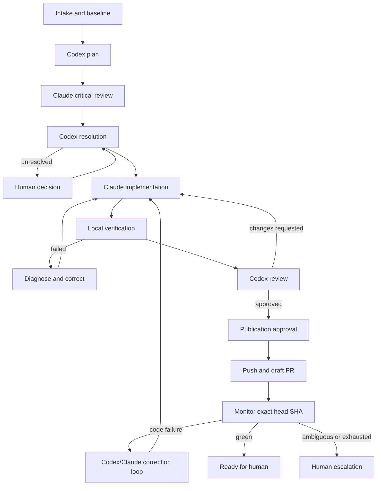

# Workflow model

## Design rule

The workflow is not represented by one giant status enum. Run lifecycle, stage
progress, agent process state, review outcome, approval state, Git state, and
remote CI state evolve independently and have different transition rules.

Materialized state is derived from explicit commands and immutable events. The
orchestrator rejects an action when any required dimension is incompatible.

## State dimensions

### Run lifecycle

```text
Created -> Running -> Completed
                   -> Failed
                   -> Cancelled

Running <-> Paused
Running -> Interrupted -> Running | Failed | Cancelled
```

- `Created`: objective and baseline exist, but execution has not started.
- `Running`: at least one stage may advance.
- `Paused`: no new external action may start; already running actions follow the
  selected pause policy.
- `Interrupted`: the previous host stopped without a terminal transition and
  reconciliation is required.
- terminal states are `Completed`, `Failed`, and `Cancelled`.

### Stage progress

`Pending`, `Ready`, `Active`, `Blocked`, `Completed`, `Failed`, or `Skipped`.

A stage becomes `Ready` only when its prerequisites and gates are satisfied.
`Blocked` always records a reason and the event or action that can unblock it.

### Attempt process state

`Queued`, `Starting`, `Running`, `Completed`, `Failed`, `Cancelled`, `TimedOut`,
or `Lost`.

A retry creates a new attempt. A previous attempt remains immutable. `Lost`
means the host cannot prove whether the external process completed and must
reconcile state before another writer starts.

### Review outcome

`Pending`, `Approved`, `ChangesRequested`, or `Escalated`.

Review approval refers to one exact Git fingerprint and evidence set. A source
change invalidates the approval.

### Current Git evidence boundary

Increment 3 records an append-only, per-workspace `GitCheckpoint` only after a
bounded, internally consistent local capture. Its fingerprint covers the exact
`HEAD`, porcelain state, complete tracked binary diff, and hashes of bounded
untracked files; a capture that changes while it is observed, times out, or
exceeds its bound is discarded. Changed-file metadata is durable, while complete
diff text stays transient and is returned only after a fresh capture still
matches the requested checkpoint. This makes a stale checkpoint an explicit
conflict rather than silently presenting it as current source evidence.

### Current verification configuration boundary

Increment 3 currently persists project-owned verification recipes as an absolute executable
path, a bounded literal argument array, timeout, and enabled state. Configuration is visible
and editable, but has no execution authority yet: it neither starts a child process nor claims
that a command passed. The following slice must snapshot an enabled recipe into a durable
attempt, run it only from the Ready isolated workspace, and bind its bounded output and result
to an unchanged Git checkpoint before it can become local-verification evidence.

### Approval state

`NotRequired`, `Pending`, `Approved`, `Rejected`, `Expired`, or `Consumed`.

An approval is scoped to one action, target, risk classification, and expected
state. The approved action consumes it. State drift expires it.

### Git publication state

`LocalOnly`, `PublicationPending`, `Pushed`, `DraftPullRequest`, `ChecksPending`,
`ChecksFailed`, `ChecksPassed`, or `ReadyForHuman`.

These states never imply permission to merge, release, deploy, force-push, or
delete a branch.

## MVP workflow



## Baseline and preconditions

Before worktree creation, the run records:

- repository canonical path and remote identity;
- current branch and commit;
- clean, dirty, or explicitly accepted working-tree state;
- applicable instruction files and their content hashes;
- configured default branch and branch naming policy;
- discovered tool paths and versions;
- verification commands;
- current standards and project-context revisions.

The MVP does not absorb uncommitted user work into an agent worktree. A dirty
baseline requires an explicit user decision and a supported isolation strategy.

## Gates

The following gates are independent:

- plan resolution gate;
- execution permission gate;
- local verification gate;
- review approval gate;
- commit gate;
- remote publication gate;
- CI correction budget gate;
- final human decision gate.

Passing one gate does not pass another. In particular, a successful local build
does not authorize push, and a green CI run does not authorize merge.

## Cross-run scheduling

Run state machines are independent. The host scheduler may advance eligible
stages for distinct canonical repositories concurrently up to the configured
global limit. Before claiming an attempt it verifies:

- global execution capacity;
- exclusive repository mutation ownership;
- exclusive worktree writer ownership;
- provider availability and account-usage guardrails;
- attempt, stage, and run budgets;
- workflow prerequisites and approvals.

A conflict leaves the stage `Ready` or `Blocked` with a durable, visible wait
reason. It never converts scheduler delay into an attempt or consumes a retry.
Pause, stop, or exhaustion for one run does not transition an unrelated run.

## Bounded loops

MVP defaults are policy values, not hard-coded domain constants:

- no more than two plan challenge rounds per material issue;
- no more than two review correction rounds;
- no more than two CI code-correction rounds;
- no more than one automatic rerun for a probable transient CI failure;
- finite wall-clock, process, output-size, and token budgets;
- immediate escalation for permission, credential, policy, or ambiguous Git
  failures.

Reaching a limit creates an escalation with accumulated evidence. It never
silently converts an incomplete run into success.

## Pause, stop, and takeover

- `Pause` prevents new work from starting. The policy decides whether the active
  process may finish, receives graceful cancellation, or requires immediate
  termination.
- `Stop` requests cancellation and leads to `Cancelled` only after external
  state is reconciled.
- `Retry` creates a new attempt from an eligible checkpoint.
- `Takeover` stops automated advancement and exposes the current worktree and
  evidence to the user. Resumption requires a fresh Git fingerprint.
- an injected human instruction is persisted, linked to the target stage, and
  included in subsequent context assembly.

## Recovery

On startup, the host marks non-terminal runs from the previous host instance as
requiring reconciliation. It then checks:

- whether recorded child processes still exist and are attributable;
- whether worktree path, branch, HEAD, index, and working-tree changes match the
  last checkpoint;
- whether a push or pull request was created despite a lost local response;
- whether GitHub checks advanced while the application was closed;
- whether an approval remains valid for the current state.

Recovery emits facts and proposes safe actions. It does not guess that an
external action failed merely because the previous host did not record its
response.
