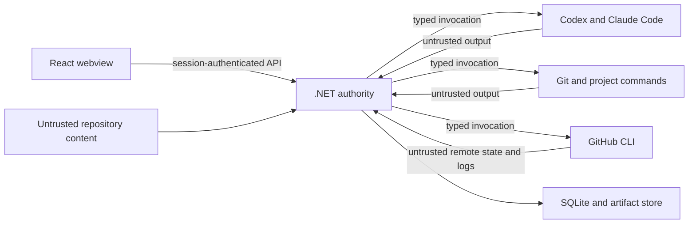

# DevalCopilot threat model

## Profile and scope

DevalCopilot uses the S2 security profile, tailored for a local-only privileged
developer tool. It is not internet-facing in the MVP, but it executes code,
modifies repositories, uses developer credentials indirectly, and may publish
changes to remote systems.

This model covers the desktop UI, local .NET host, persistence, agent processes,
project commands, Git worktrees, GitHub integration, and self-hosted development.

## Assets and impact

| Asset | Required property | Credible impact |
|---|---|---|
| Source repositories and history | Integrity, availability | Corruption, hidden change, or lost work |
| Developer credentials and sessions | Confidentiality, scoped use | Account or repository compromise |
| Workflow decisions and approvals | Integrity, attribution | Unauthorized or misleading action |
| DevalCopilot executable and updates | Integrity | Persistent privileged compromise |
| Run database and artifacts | Confidentiality, integrity | Sensitive code/log disclosure or false evidence |
| GitHub branches, PRs, checks, and settings | Integrity | Unreviewed publication or supply-chain compromise |
| Workstation resources | Availability | Runaway processes, disk exhaustion, or denial of service |

## Actors and identities

| Actor | Identity source | Intended authority |
|---|---|---|
| Developer | Local interactive session | Configure projects, approve actions, intervene |
| React frontend | Per-launch local session | Submit authenticated intentions and read state |
| Tauri shell | Signed local application process | Start and observe the .NET sidecar |
| .NET host | Local application instance | Enforce workflow, policy, persistence, and adapters |
| Codex | Existing provider CLI session | Produce scoped analysis and review output |
| Claude Code | Existing provider CLI session | Produce scoped critique and source changes |
| Git | Existing repository credentials | Perform orchestrator-authorized local and remote operations |
| GitHub CLI | Existing authenticated CLI session | Perform orchestrator-authorized GitHub operations |
| Project commands | Repository-defined toolchain | Build, test, format, or inspect within approved scope |

Agent and project processes are not trusted identities. Their output cannot
authorize an action.

## Trust boundaries and data flow

## Primary abuse cases and controls

### Prompt injection from repository or external evidence

An instruction in source, documentation, an issue, agent output, dependency
output, or CI log attempts to expand permissions or disable controls.

Controls:

- label external content as untrusted evidence;
- keep policy and authority outside model context;
- use typed protocol responses;
- provide only bounded relevant excerpts;
- reject tool requests that exceed the current capability grant;
- require orchestrator and human gates independent of agent claims;
- test representative injection strings through repository and CI paths.

### Shell or argument injection

Untrusted objective, path, branch, filename, or agent output changes the command
being executed.

Controls:

- use fixed discovered executables and typed argument lists;
- never invoke through `cmd.exe`, PowerShell command text, or a shell unless a
  project explicitly owns and approves that interpreter boundary;
- canonicalize paths beneath approved roots;
- validate branch and remote identifiers through closed policies;
- do not expose a generic shell command from the frontend;
- capture exit status and bounded streams separately.

### Worktree escape or user-work corruption

An agent writes outside its worktree, modifies the active checkout, or absorbs
uncommitted user changes.

Controls:

- create an isolated worktree with an ownership marker;
- configure an explicit working directory and approved root;
- allow one writer;
- fingerprint branch, HEAD, index, and working tree before and after stages;
- block dirty or ambiguous baselines pending a user decision;
- never run self-hosted development against the active executable checkout.

Residual risk: a locally privileged child process may ignore working-directory
conventions. Strong OS or container sandboxing is deferred and must remain a
visible residual risk.

### Credential disclosure

Prompts, logs, artifacts, errors, or screenshots capture GitHub, provider, SSH,
package, or environment secrets.

Controls:

- reuse CLI-managed authentication without extracting tokens;
- never persist complete process environments;
- minimize inherited environment variables where compatible;
- apply bounded redaction before persistence and display;
- exclude known credential files and user profile traversal;
- keep raw sensitive artifacts access-controlled and retention-limited;
- test logs and bundles for known secret patterns.

### Unauthorized remote mutation

An agent, compromised frontend, or stale approval pushes, rewrites, merges, or
publishes unintended source.

Controls:

- only the .NET host invokes Git and GitHub adapters;
- scope approval to action, repository, branch, expected SHA, and run;
- expire approval on state drift;
- restrict autonomous mutation to tool-owned branches;
- prohibit default-branch push, force-push, merge, release, deployment, and
  administration in the MVP;
- rely on repository branch protections as defense in depth;
- record every attempted and observed remote action.

### False or stale verification

The application associates a passing test or CI result with the wrong source
state.

Controls:

- bind local verification and review to a full Git fingerprint;
- correlate CI by repository, branch, and exact head SHA;
- invalidate approval after any source change;
- preserve workflow attempt identifiers and conclusions;
- never interpret absent, neutral, skipped, stale, or unknown checks as success
  without explicit repository policy.

### Duplicate external action after timeout or crash

A push, pull request creation, rerun, or process launch succeeds, but the local
response is lost and recovery repeats it.

Controls:

- persist intent and correlation before action;
- query observable process, Git, and GitHub state before retry;
- use deterministic branch and pull request identity;
- create immutable attempts;
- mark ambiguous operations `Lost` and require recovery resolution.

### Resource exhaustion

An agent or command emits unlimited output, loops, spawns descendants, consumes
disk, or repeatedly triggers CI.

Controls:

- finite wall-clock, output, artifact, token, retry, and correction budgets;
- bounded channels with explicit overflow behavior;
- process-tree termination;
- disk-space checks and artifact retention;
- one active MVP workflow;
- visible budget-exhaustion escalation.

### Malicious candidate self-update

A candidate DevalCopilot version compromises the stable controller or replaces
the running executable without verified review.

Controls:

- stable version controls a separate candidate worktree and data directory;
- no in-place automatic update in the MVP;
- candidate build and test do not inherit unrestricted production data;
- complete diff, local tests, CI, and human approval precede adoption;
- future updater design requires a separate threat model and ADR.

## Security evidence required for the MVP

- architecture tests for inward dependencies and provider isolation;
- API tests for loopback binding, session authentication, and explicit endpoint
  authorization;
- tests proving the frontend lacks generic shell authority;
- path traversal and worktree-root tests;
- argument construction and malicious-input adapter tests;
- structured-output validation tests;
- approval scope and invalidation tests;
- exact-SHA CI correlation tests;
- crash and duplicate-action reconciliation tests;
- output, loop, and artifact budget tests;
- secret-pattern scan of source, frontend bundle, logs, and fixtures;
- manual review of the self-hosting demonstration.

## Residual risks

| Risk | MVP position | Review trigger |
|---|---|---|
| Agents run with the developer's operating-system privileges | Accepted for supervised local MVP with constrained worktrees | Before unattended mode or third-party repositories |
| CLI authentication may have broader repository scope than one run needs | Minimized through orchestrator policy; token remains CLI-owned | Before enabling automatic publication by default |
| No strong container or OS sandbox around source execution | Containers remain optional and visible | Before running untrusted repositories |
| User-local database and artifacts are not field-encrypted | Depend on workstation and filesystem protection | If sensitive multi-user or regulated data enters scope |
| Polling may observe GitHub state with delay | Acceptable for local single-user workflow | If latency or API limits become operational problems |
